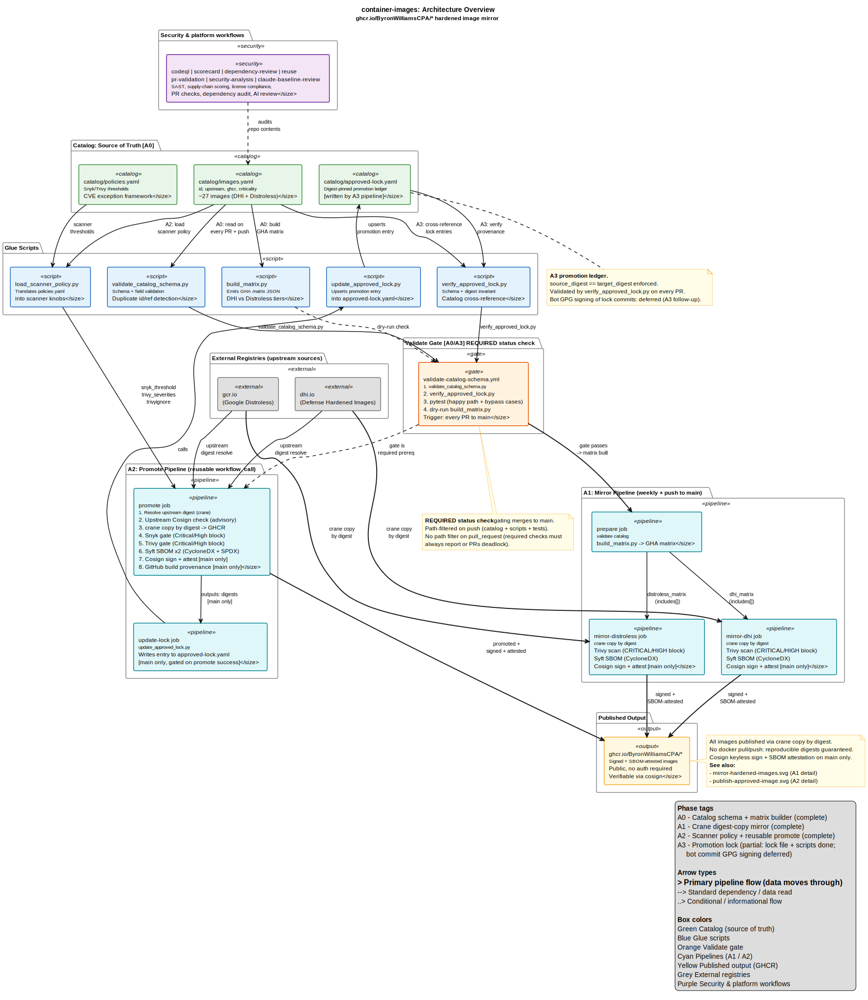
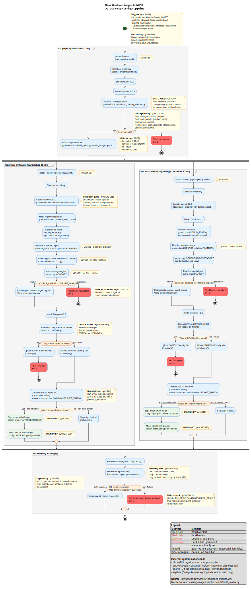
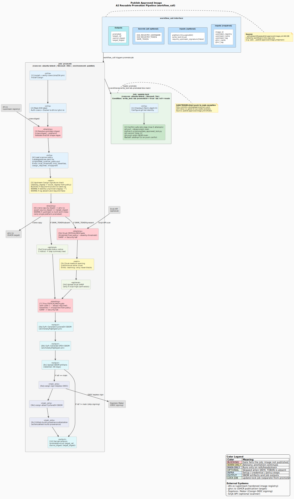
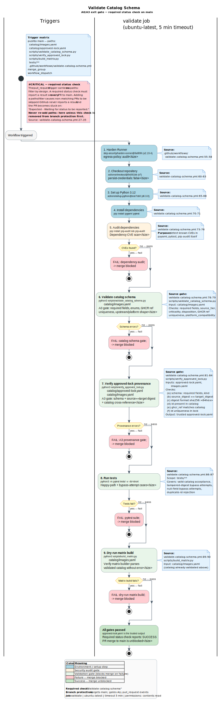

# Workflow Diagrams

Visual documentation of the GitHub Actions workflows in this repository.
Every diagram is scoped to `container-images` only: external container
registries the workflows talk to (`dhi.io`, `gcr.io`, `ghcr.io`) and signing
infrastructure (Sigstore/Rekor, Snyk API) are shown as external systems, but no
other repository or downstream image-consumer repo is depicted.

Each diagram is committed as both PlantUML source (`.puml`) and a rendered SVG.
To regenerate after editing a source file:

```bash
java -jar ~/.cache/plantuml/plantuml.jar -tsvg docs/diagrams/<name>.puml
```

## Index

| Diagram | Phase | Source workflow | Files |
| --- | --- | --- | --- |
| System overview | A0-A3 | (whole repo) | [overview.svg](overview.svg) / [overview.puml](overview.puml) |
| Mirror hardened images | A1 | [mirror-hardened-images.yml](../../.github/workflows/mirror-hardened-images.yml) | [mirror-hardened-images.svg](mirror-hardened-images.svg) / [.puml](mirror-hardened-images.puml) |
| Publish approved image | A2 | [publish-approved-image.yml](../../.github/workflows/publish-approved-image.yml) | [publish-approved-image.svg](publish-approved-image.svg) / [.puml](publish-approved-image.puml) |
| Validate catalog schema | A0/A3 | [validate-catalog-schema.yml](../../.github/workflows/validate-catalog-schema.yml) | [validate-catalog-schema.svg](validate-catalog-schema.svg) / [.puml](validate-catalog-schema.puml) |

## Diagrams

### System overview (start here)



A single-screen mental model. `catalog/images.yaml` is the source of truth that
drives the A0 validate gate, the A1 mirror pipeline, and the A2 promote
pipeline; outputs are the published images on GHCR and the A3
`approved-lock.yaml` promotion ledger. The seven security and platform
workflows (CodeQL, Scorecard, dependency-review, REUSE, pr-validation,
security-analysis, claude-baseline-review) are shown as a single labelled group
without internals.

### A1: Mirror hardened images



The weekly mirror. `prepare` validates the catalog and builds the matrices, then
`mirror-dhi` and `mirror-distroless` fan out per matrix entry: crane copy by
resolved digest, a source-equals-target digest assertion, Trivy scan gate, Syft
SBOM, and cosign sign plus attest on `main` only. The `summary` job aggregates
results and fails the run if either mirror job did not succeed.

### A2: Publish approved image (reusable)



The `workflow_call` promotion gate. The `promote` job runs an ordered pipeline:
digest resolve, policy load, upstream cosign check, copy by digest, Snyk and
Trivy gates, dual-format SBOM, and sign plus attest on `main`. Blocking gates,
warn-only steps, optional (Snyk-when-token-absent) steps, and main-only steps
are color-coded. The `update-lock` job then writes the promotion entry to
`approved-lock.yaml` through a conflict-safe retry loop (the one sanctioned
direct-push-to-main path).

### A0/A3: Validate catalog schema (required check)



The required status check that gates every merge to `main`. A single `validate`
job runs schema validation, A3 approved-lock provenance verification, the pytest
suite, and a dry-run matrix build in sequence; any failure blocks the merge. The
diagram highlights why the `pull_request` trigger deliberately carries no
`paths:` filter (a path-filtered required check would deadlock PRs).

## Maintenance notes

- Diagrams are hand-authored PlantUML, not auto-generated from the YAML. When a
  workflow's job graph or gate sequence changes, update the matching `.puml`
  and re-render the `.svg`.
- Source-line reference notes inside each `.puml` point back to the workflow
  file for traceability; refresh them if the referenced lines move materially.
